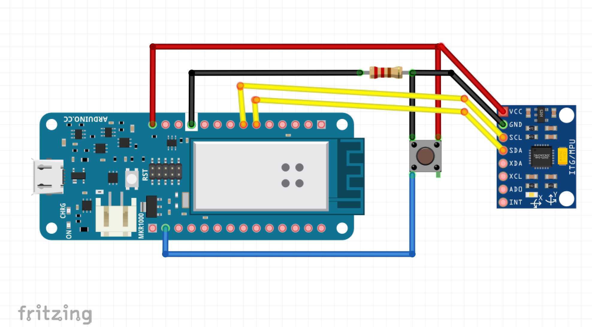

# Gesture recognition with Johnny-five, Arduino and Machine learning.

## Current status:

**WIP**

Recording, training and predicting works but the accuracy of the model is not sufficient (0.5), probably due to the data from Arduino that is not really precise.

## Material needed

* Microcontroller: Arduino MKR1000
* Accelerometer / gyroscope: MPU6050
* Button
* Resistor
* Wires

## Wiring:



[Source](https://maker.pro/arduino/tutorial/how-to-interface-arduino-and-the-mpu-6050-sensor)

Connect `VIN` to 5V, `GND` to `GND`, `SDA` to 11 and `SCL` to 12.

## Set up

1. Download / open the Arduino IDE.
2. Open the `StandardFirmata` sketch.
3. Set up your wifi network and passowrd.
4. Check your Arduino IP address.
5. Upload the sketch to your Arduino.
6. Go inside the `examples` folder and pick either `game` for street fighter or `harry-potter` to predict spells.
7. Open the `record.js` file and modify the IP address to match the one of your Arduino.
8. Run `node record.js <gesture type> <sample number>`

## Commands

### Recording data

The `node record.js` command will start recording data from the sensor as long as you hold the button down.

This command takes 2 arguments: a *gesture type* and a *sample number*.

```js
node record.js expelliarmus 0
```

Providing these 2 arguments will help save the data in separate files, e.g *sample_expelliarmus_0.txt*.

### Training

Once you've recorded data for multiple gestures, you can train a machine learning algorithm to find patterns in this data so it will be able to classify new samples of data it has never seen before.

```
note: this process is going to allow an algorithm to look at all the data from all samples of all gestures, and try to figure out what "makes" an "expelliarmus", an "expelliarmus", and a "lumos", a "lumos". Once it has figured out some patterns and the accuracy of our model is good (more than 0.7), we can use the model created to give it new live data it has not been trained with and try to classify it between the different gestures it "knows".
```

```js
node train.js
```

### Predicting

Once our model is created and saved, we can load it in our application and give it new data to try and classify live gestures.

```js
node predict.js
```

Once the Arduino is connected and data is streaming from the sensor, hold the button down, execute one of the gestures previously done, release the button and the model will classify the new sample.

---

## Next steps:

* Potentially change sensor to get more precise data
* Add error handling
* Use a LSTM algorithm for continuous prediction
* Refactor code

## To do:

- [ ] Add license